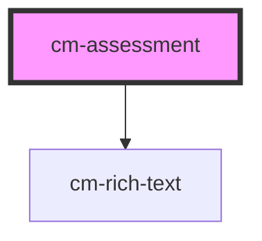

# my-component

<!-- Auto Generated Below -->

## Properties

| Property       | Attribute | Description                                  | Type                  | Default     |
| -------------- | --------- | -------------------------------------------- | --------------------- | ----------- |
| `intro`        | --        | Rich text introduction to the assessment     | `TRichTextItem[]`     | `undefined` |
| `name`         | `name`    | The name of the assessment                   | `string`              | `undefined` |
| `questions`    | --        | Data containing the assessment questions     | `{ pages: TPage[]; }` | `undefined` |
| `resultsIntro` | --        | Rich text introduction for the results page  | `TRichTextItem[]`     | `undefined` |
| `slug`         | `slug`    | A URL-friendly identifier for the assessment | `string`              | `undefined` |

## Dependencies

### Depends on

- [cm-rich-text](../cm-rich-text)

### Graph

----------------------------------------------

*Built with [StencilJS](https://stenciljs.com/)*
