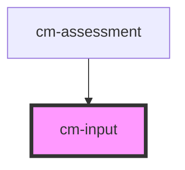

# cm-input

<!-- Auto Generated Below -->

## Properties

| Property | Attribute | Description | Type       | Default     |
| -------- | --------- | ----------- | ---------- | ----------- |
| `label`  | `label`   |             | `string`   | `undefined` |
| `name`   | `name`    |             | `string`   | `undefined` |
| `value`  | --        |             | `string[]` | `undefined` |

## Events

| Event         | Description | Type                    |
| ------------- | ----------- | ----------------------- |
| `valueChange` |             | `CustomEvent<string[]>` |

## Dependencies

### Used by

 - [cm-assessment](../cm-assessment)

### Graph

----------------------------------------------

*Built with [StencilJS](https://stenciljs.com/)*
