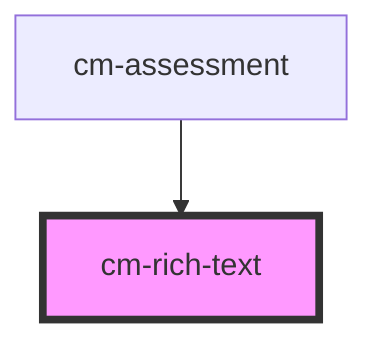

# cm-rich-text

<!-- Auto Generated Below -->

## Properties

| Property  | Attribute | Description | Type              | Default     |
| --------- | --------- | ----------- | ----------------- | ----------- |
| `content` | --        |             | `TRichTextItem[]` | `undefined` |

## Dependencies

### Used by

 - [cm-assessment](../cm-assessment)

### Graph

----------------------------------------------

*Built with [StencilJS](https://stenciljs.com/)*
